# Eskom Expo Platform

## Introduction

The Eskom Expo Hub was developed to solve the inefficiencies of the traditional Eskom Expo judging and event management process. The existing system relied heavily on paper-based scoring, manual project evaluations, and inconsistent mark reconciliation — leading to delays, human error, and limited transparency. Judges faced high workloads, while convenors struggled to manage multiple stages of the competition across districts and regions. Eskom Expo Hub was designed to digitize and streamline the entire process — from project submission and judging to event coordination and reporting. The platform enables real-time scoring, conflict detection, automated data management, and user-friendly dashboards for learners, teachers, judges, and convenors, ensuring a fair, efficient, and modernized experience for South Africa’s leading science fair.

## 1. High-Level Project Narrative

This repository contains a comprehensive, full-stack platform designed to manage the entire lifecycle of a science fair or similar academic competition. The system is engineered to serve three distinct user groups: administrators (who oversee the event), participants (learners and teachers), and judges (who evaluate the projects).

The application workflow mirrors the real-world process of a science fair:

1.  **Setup & Registration:** An administrator first creates an event using the web dashboard, defining its name, dates, and registration window. During this window, teachers, learners, and prospective judges can register through dedicated, multi-step forms in the web application.
2.  **Project Submission:** Once registered, learners can submit their projects, including descriptions and supporting documents, through their dashboard.
3.  **Judging & Evaluation:** On the day of the event, judges use a dedicated mobile application. They can view their assigned projects, submit scores on digital marksheets, and flag ethical concerns. The system is designed to handle scoring conflicts between judges, escalating them to convenors for resolution.
4.  **Real-time Monitoring & Management:** Throughout the event, administrators and convenors can use the web dashboard to monitor judging progress in real-time, manage user roles, and handle any issues that arise.
5.  **Results & Reporting:** After judging is complete, the system calculates total scores, and administrators can view and generate final reports.

## 2. Technical Architecture Deep Dive

The platform is built on a modern, three-part architecture: a React-based web frontend, a Node.js backend API, and a React Native mobile application.

### `team37-api` (Backend API)

The backend is the central nervous system of the platform, built with Node.js and the Express.js framework. It is responsible for all business logic, data persistence, and real-time communication.

#### Core Responsibilities & Features:

*   **RESTful API Service:** It exposes a wide array of RESTful endpoints that the web and mobile applications consume. The routes, organized by feature (e.g., `userRoutes.js`, `projectRoutes.js`, `eventRoutes.js`), allow for granular control over every aspect of the competition. For example, a `POST` request to `/api/projects` would handle a new project submission, while a `GET` request to `/api/events/:eventId/judges` would retrieve all judges for a specific event.
*   **Database Management:** The API uses a PostgreSQL database for data storage. On startup, it runs a comprehensive initialization script (`initDB` function in `server.js`) that creates the entire database schema if it doesn't exist. This ensures a consistent data structure across all environments.
*   **Security:** The API leverages `helmet` to set secure HTTP headers, protecting against common web vulnerabilities like cross-site scripting (XSS) and click-jacking. It also uses `cors` to manage cross-origin requests and `dotenv` to handle environment variables securely, keeping sensitive information like database credentials out of the source code.
*   **Real-time Communication:** A key feature is its use of WebSockets (`ws` library). This enables real-time, bidirectional communication with clients. This is likely used for features like:
    *   Pushing live notifications to judges' mobile apps (e.g., a new project has been assigned, or a scoring conflict requires their attention).
    *   Updating the admin dashboard in real-time to show judging progress or new user registrations without needing to refresh the page.
*   **Request Logging:** The `morgan` middleware is used in development mode (`dev`) to log incoming HTTP requests, which is invaluable for debugging.

#### Database Schema Insights:

The database schema is highly relational and provides a clear picture of the application's domain model.

*   **User & Roles:** A central `users` table holds common information (name, email, etc.). This is linked to specialized role tables like `judges`, `teachers`, `learners`, and `conveners`, which hold role-specific data. For instance, a `judges` record contains their qualifications and judging history, and it links back to a `users` record via a foreign key.
*   **Events & Projects:** The `events` table is the top-level container. Each `project` is linked to an `event` and a `learner`.
*   **Judging & Scoring:** The `marksheets` and `ethicsMarksheets` tables are crucial. When a judge scores a project, a new `marksheet` record is created, linked to the `project`, the `judge`, and the `event`.
*   **Conflict Resolution:** The `conflicts` table is designed to manage scoring discrepancies. If two judges give significantly different scores to the same project, a record is created in this table, flagging it for review by a convenor.

### `team37` (Web Frontend)

The web application is a sophisticated Single-Page Application (SPA) built with React and Vite. It serves as the primary interface for administrators, teachers, and learners.

#### User Experience & Functionality:

*   **Role-Based Access Control:** The application provides different views and functionalities based on the logged-in user's role. The routing configuration in `routes.jsx` clearly defines which pages are accessible to which roles.
*   **Admin Dashboard:** This is the most feature-rich part of the web app. Administrators can perform CRUD (Create, Read, Update, Delete) operations on nearly all data models:
    *   **Events:** Create new science fairs.
    *   **Users:** View all registered users, manage their roles, and approve judge registrations.
    *   **Projects:** View all submitted projects for an event.
    *   **Schools:** Manage the list of participating educational institutions.
*   **Participant Portal:** Learners and teachers have their own dashboard views. Learners can submit their projects through a guided form (`AddProject` page) and view the status of their submissions (`ProjectList` page).
*   **Multi-Step Registration:** The application features a user-friendly, multi-step registration process (`SignUp`, `SignUpStep2`, `JudgeRegistration`, etc.) to collect detailed information from different user types without overwhelming them on a single form.

### `team37-mobile` (Mobile App)

The mobile app, built with React Native and Expo, is a specialized tool designed for judges to use on the day of the science fair. Its focus is on efficiency and real-time interaction.

#### Judge's Workflow & Features:

*   **Focused UI:** The app's navigation, defined in `app/_layout.tsx`, is streamlined for the judging process. It includes screens for `marking`, `ethics-marksheet`, and `about-conflict`.
*   **QR Code Integration:** The `scan` screen, which utilizes `expo-barcode-scanner`, allows judges to quickly access project details or check in by scanning a QR code at the project's station.
*   **Digital Marking:** The core feature is the `marking` screen. Here, a judge can view project details and fill out a digital marksheet. The state for this process is likely managed by the `MarksheetProvider` and `ProjectProvider` contexts, which fetch and manage the relevant data from the backend.
*   **Conflict Management:** When a scoring conflict arises, the judge would be notified (via WebSocket) and directed to the `about-conflict` screen to see the details and potentially communicate with the other judge or a convenor. The `ConflictProvider` context would manage the state for this interaction.
*   **State Management via Context:** The use of multiple React Context providers (`WebSocketProvider`, `ConflictProvider`, `MarksheetProvider`, etc.) indicates a well-structured approach to managing different domains of application state, making it easier to share data between components without prop drilling.

## 3. Setup and Execution

### `team37-api` (Backend API)

1.  Navigate to the `team37-api` directory.
2.  Install dependencies: `npm install`
3.  Create a `.env` file and populate it with the necessary environment variables (e.g., database connection string, port).
4.  Start the server: `npm run back`

### `team37` (Web Frontend)

1.  Navigate to the `team37` directory.
2.  Install dependencies: `npm install`
3.  Start the development server: `npm run dev`

### `team37-mobile` (Mobile App)

1.  Navigate to the `team37-mobile` directory.
2.  Install dependencies: `npm install`
3.  Start the Metro bundler: `npm start`
4.  Follow the on-screen instructions to run the app on an emulator or a physical device with the Expo Go app.

## 4. Development Conventions

*   **Code Formatting:** The entire project uses Prettier to maintain a consistent code style.
*   **Linting:** The mobile application uses ESLint to enforce code quality and catch potential errors.
*   **Modular Structure:** Each of the three parts of the project is self-contained in its own directory with its own dependencies, promoting a clean separation of concerns.

## 5. Screenshots

### 5.1. Admin Dashboard
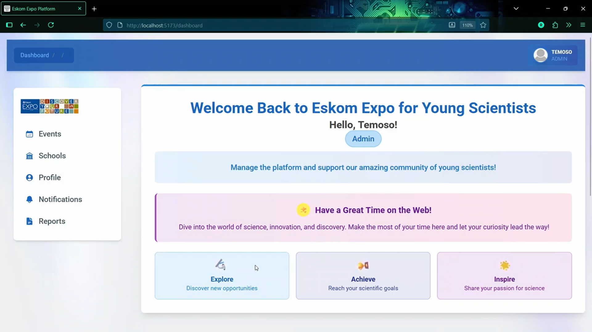

### 5.2. Events Management
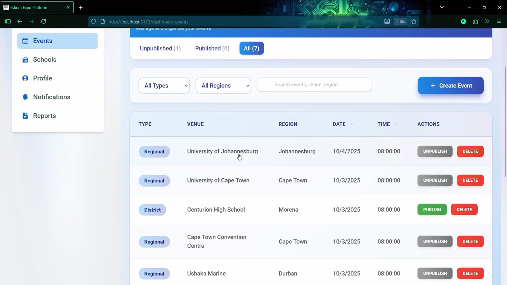

### 5.3. Judge Projects Allocation
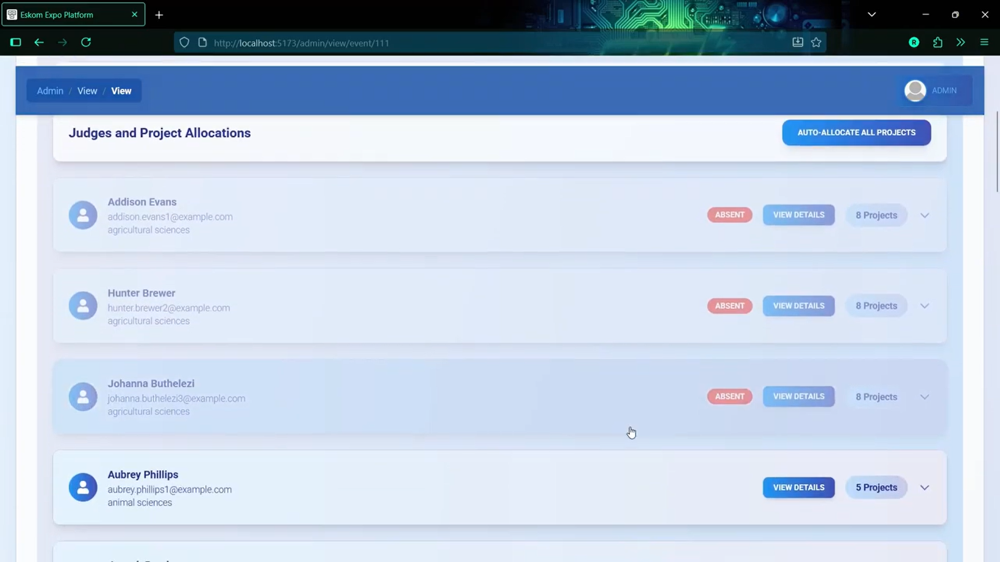

### 5.4. Projects Management
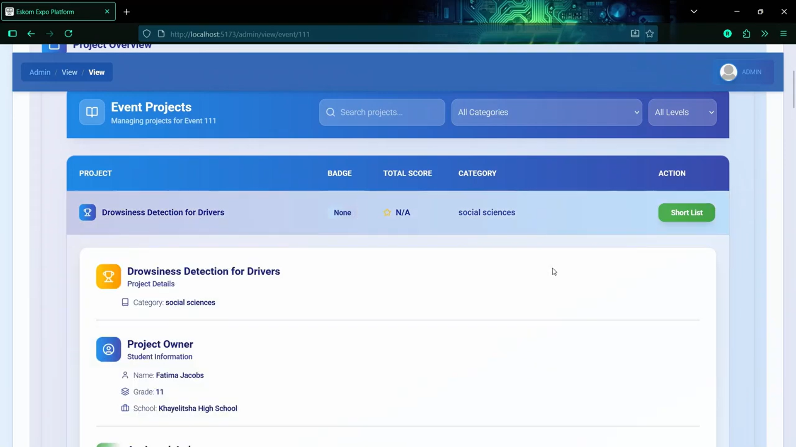

### 5.5. Judge Login
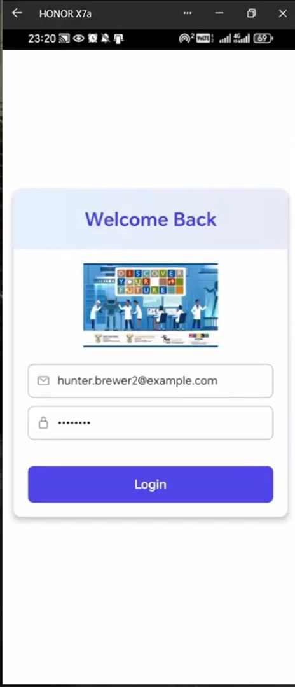

### 5.6. Judge Event Attendence

### 5.7. Marksheet Assignement
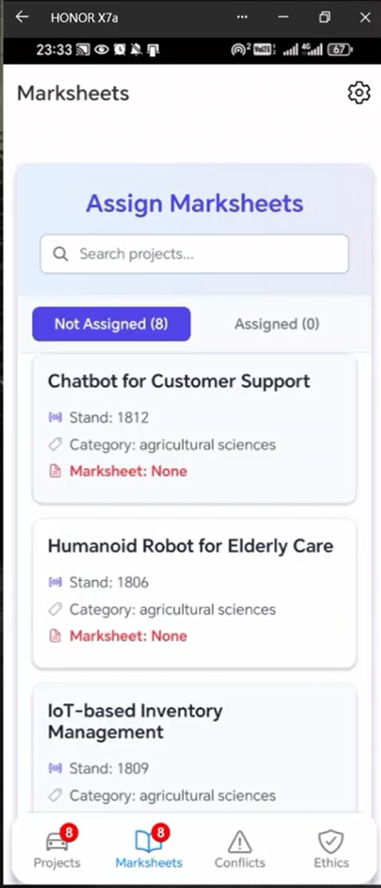

### 5.8. Marksheet Assignement
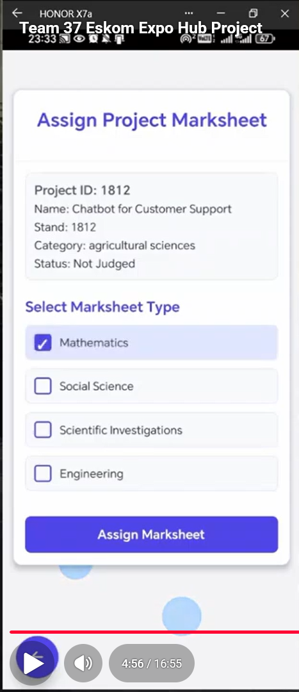

### 5.9. Project Marking
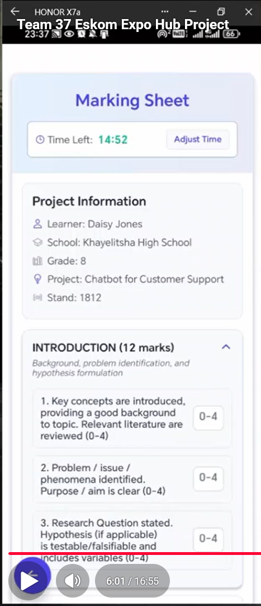

### 5.10. Marking Complete
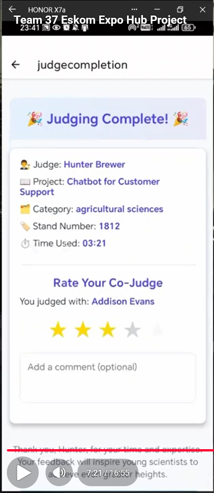

### 5.11. Mark Conflicts Handling
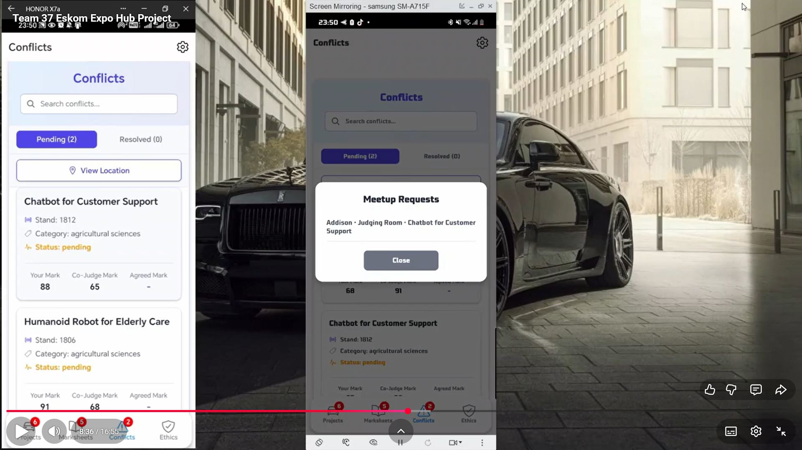

### 5.12. Co-Judge Tracking
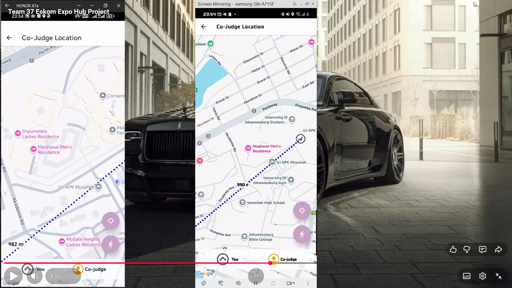

### 5.13. Agreed Mark
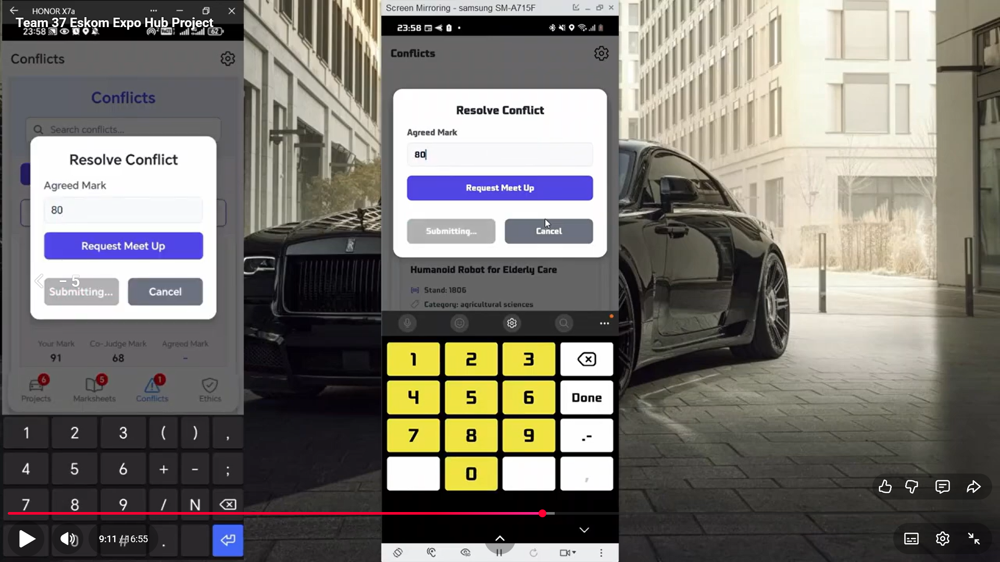

### 5.14. Co-Judge Rating
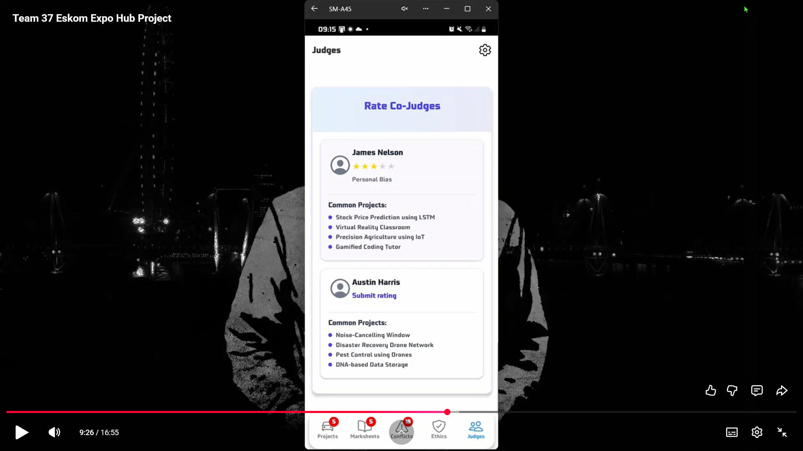

